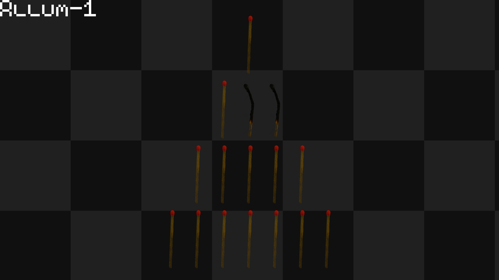

# Allum1



Fun project, we had to create a 100% winrate AI for a simple match game.

(Bonus; for privacy reasons, pictures from ./bonus -d have been blurried)

Screenshots available !

## Usage

./allum1 -h :
```
Help :
-l : sets number of lifes for each player (default is 1)
-L : sets number of lines (default is 4)
-p : local multiplayer
-w : sets starting number of matches on line 1 (default is 1)
-h : displays help menu
Have fun playing Allum-1 !
Made by rotaru_i
```

## Bonus

You'll need LibLapin 1.7 (from Jason Brillante) in order for it to work.

In bonus folder :

run :
```
make
```

and

```
./bonus
```

or

```
./bonus -d
```

## Scores

Moulinette : 100%

Pitch : 23